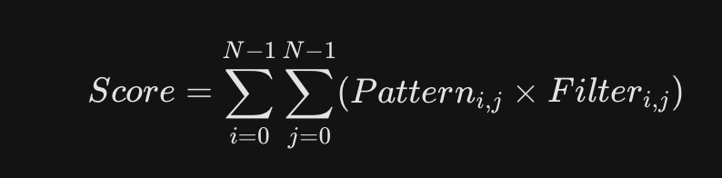
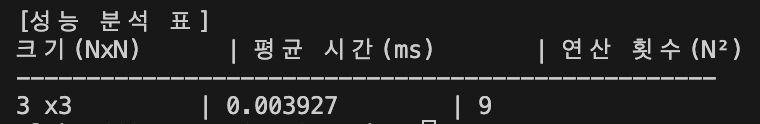
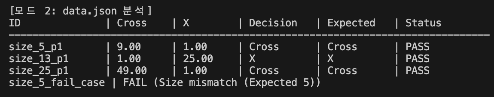
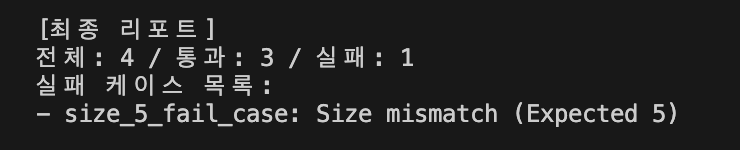
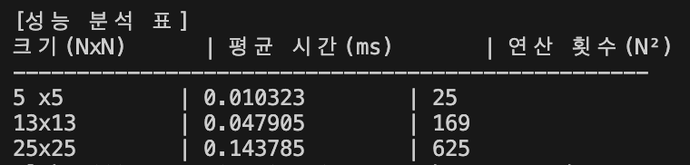
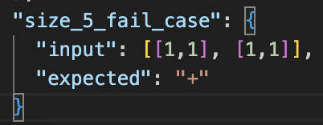
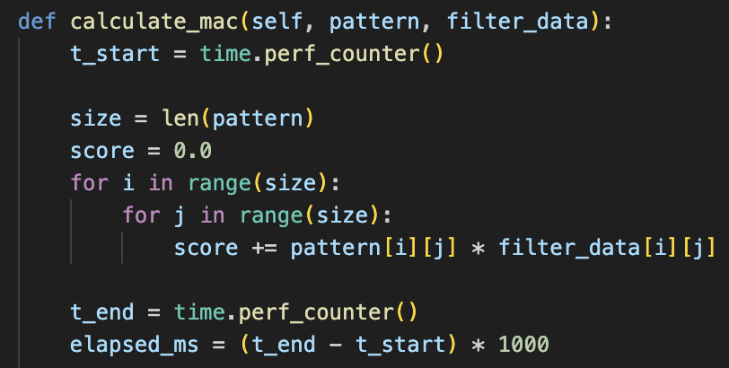
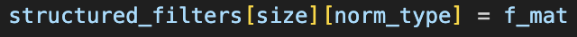
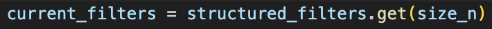

# 1. 프로그램 개요
📊 Matrix Pattern Analyzer (MAC Calculator)

이 프로그램은 JSON 형식으로 정의된 다양한 크기의 필터와 패턴 데이터를 로드하여, MAC(Multiply-Accumulate) 연산을 통해 패턴을 분석하고 가장 유사한 결과를 판정하는 도구입니다.

# 2. 🛠 주요 기능
동적 데이터 로딩: 5×5, 13×13, 25×25 등 다양한 크기의 행렬 데이터를 data.json에서 자동으로 파싱합니다.

라벨 정규화 (Normalization): +, cross, x 등 제각각인 이름표를 Cross, X와 같은 표준 규격으로 통일하여 처리합니다.

MAC 연산 엔진: 패턴과 필터 간의 점수를 계산하여 가장 유사도가 높은 필터를 판정합니다.

성능 분석 보고서: 각 크기별 연산 횟수와 소요 시간을 측정하여 성능 분석 표를 생성합니다.

견고한 예외 처리: 데이터 크기 불일치(Size mismatch)나 잘못된 입력을 사전에 차단하고 재입력을 유도해 프로그램의 안정성과 연속성을 보장합니다.

# 3. 📂 파일 구조

main.py: 프로그램 실행 및 메인 로직 및 행렬 연산 및 정규화 로직을 담은 클래스

data.json: 필터 및 테스트 패턴 데이터 (사용자 정의 가능)

image: 출력화면 등 스크린샷

# 4. 실행 방법

## 1. 환경 요구 사항
Python 3.8 이상

## 2. 데이터 준비(data.json)
프로젝트 폴더에 아래와 같은 형식의 data.json 파일을 준비합니다.
```bash
{
  "filters": {
    "size_5": {
      "cross": [
        [0,0,1,0,0],
        [0,0,1,0,0],
        [1,1,1,1,1],
        [0,0,1,0,0],
        [0,0,1,0,0]
      ],
      "x": [
        [1,0,0,0,1],
        [0,1,0,1,0],
        [0,0,1,0,0],
        [0,1,0,1,0],
        [1,0,0,0,1]
      ]
    }
  },
  "patterns": {
    "test_1": {
      "input": [
        [0,0,1,0,0],
        [0,0,1,0,0],
        [1,1,1,1,1],
        [0,0,1,0,0],
        [0,0,1,0,0]
      ],
      "expected": "+"
    }
  }
}
```
## 3. 프로그램 실행
```bash
python main.py
```
# 5. 💡 주요 알고리즘: MAC 연산
이 프로그램은 두 행렬의 동일한 위치값을 곱하고 모두 더하는 MAC(Multiply-Accumulate) 연산을 수행합니다.



N: 행렬의 크기 (5, 13, 25 등)

i,j: 행렬 내의 행과 열의 위치 (좌표)

Pattern 
i,j
​	
 : 입력받은 데이터의 특정 칸 값

Filter 
i,j
​	
 : 비교 대상(Cross 또는 X) 필터의 특정 칸 값

∑ (시그마): 모든 칸에서 계산한 값을 하나도 빠짐없이 다 더하기
#
결과값이 가장 높은 필터를 최종 결과로 선정합니다.

두 필터의 점수 차이가 미세(10 
−9
  이하)할 경우 UNDECIDED로 판정합니다.

# 6. 📋 출력 결과 예시

프로그램 실행 시 콘솔에 다음과 같은 일괄 판정 결과와 성능 분석 표가 출력됩니다.

모드 1 동점 판정결과


모드 2 판정결과

#
전체 테스트 수/통과 수/실패 수 및 실패 케이스 목록 요약

#
모드 1 성능 분석표


모드 2 성능 분석표


# 7. ⚠️ 주의 사항

input 행렬의 크기는 반드시 해당 패턴의 키 이름(예: size_5)에 명시된 숫자와 일치해야 합니다.

일치하지 않을 경우 FAIL (Size mismatch) 상태와 함께 해당 케이스는 스킵됩니다.

# 8. 💡 기술 분석 보고서 (Technical Analysis Report)

본 프로그램의 판정 정확도와 실행 효율성을 보장하기 위해 다음과 같은 핵심 기술적 요소들을 분석하였습니다.


## 1. 실패 원인 및 예외 처리 분석
### 1. 잘못된 입력
라벨 및 스키마 불일치: JSON 데이터 로드 시 size_N 형식의 키에서 정수 N을 추출하는 파싱 로직을 적용했습니다. 만약 키 이름이 규격(size_숫자)을 벗어나거나, input 행렬의 실제 차원이 추출된 N과 다를 경우 Size mismatch 에러를 발생시켜 연산 오류를 사전에 차단합니다.
### 2. 부동소수점 오차
부동소수점 정밀도 문제: 파이썬의 float 자료형은 무한 소수로 인해 미세한 연산 오차가 발생할 수 있습니다. 이를 해결하기 위해 두 점수를 직접 비교(==)하지 않고, 두 값의 차이인 abs(score1 - score2)가 임계값(10−9)보다 작은지 확인하는 Epsilon 비교 정책을 도입하여 판정의 안정성을 확보했습니다.
### 3. 라벨 정규화
+, cross, X, size_5_x 등 사용자마다 다른 입력 라벨을 normalize_label 메소드를 통해 표준화함으로써, 데이터 입력의 자율성을 보장하면서도 내부 로직의 일관성을 유지했습니다.
### 4. 실패 원인
실패 케이스의 실패 원인은 input 행렬의 실제 차원이 추출된 N과 다르다는게 원인으로 확인됩니다.

### 5. 시간 측정 경계

행렬 내적 계산 함수 내에서 연산 코드 시작 전후로 시간을 측정해서 입출력 시간이 들어가 측정시간의 오차가 발생하는것을 방지했습니다.
## 2. 시간 복잡도 분석 (Complexity Analysis)
### 1. mac 연산
MAC 연산 효율성: 하나의 패턴을 판정하기 위해 N×N 크기의 행렬을 2중 루프로 순회합니다. 각 필터(Cross, X)에 대해 연산을 수행하므로, 패턴당 시간 복잡도는 **O(N^2)**입니다.
#
MAC 연산 점수 유사도: MAC 연산은 두 행렬을 길게 펼쳐서 내적을 구하는 것과 같습니다. 일치하는 경우 가중치 만큼 점수가 누적이 되고 불일치 하는 경우 0이 되어 점수에 기여하지 못하므로 지정한 자리에 패턴의 선이 겹칠수록 점수가 높아지는 구조입니다. 따라서 점수가 높을수록 두 패턴과 필터는 유사하다고 판단할수 있습니다.
#
실행결과 N이 5에서 25로 5배 증가할 때, 연산 횟수는 25에서 625로 25배(N^2) 증가합니다. 실제 측정 결과, 대형 행렬일수록 연산 소요 시간이 기하급수적으로 늘어나는 N^2 그래프의 특성을 보임을 확인했습니다.

### 2. 데이터 로드
데이터 로딩: JSON 로드 및 필터 구조화 작업은 프로그램 시작 시 단 1회 수행되며, 딕셔너리의 해시 테이블 구조를 활용하여 각 패턴에 맞는 필터를 **O(1)**의 상수로 즉시 찾아내도록 설계하여 대량의 일괄 처리 상황에서도 최적의 성능을 발휘합니다.
#
전처리(데이터를 서랍장에 미리 분류해서 넣기)


해시 테이블 접근(O(1)) 단계(분류해둔 데이터를 사용해서 즉시 접근)


## 3. 심층 인터뷰
### 1. 1000x1000 패턴 처리 시 문제점 및 최적화
값이 0인 부분을 0이 아닌 좌표 정보만 저장하는 희소 행렬 형식을 사용해서, 데이저 저장 용량을 줄이고 0인 부분의 연산을 생략해서 계산 속도를 높일수 있습니다.
#
파이썬의 멀티프로세싱 모듈을 사용하여 cpu 코어 여러개가 각각 다른 필터를 동시의 병렬처리 하도록 해서 처리 시간을 단축시킵니다.
### 2. cpu 직렬처리 npu 병렬 처리 병목
cpu의 npu에 비해서 한 입력에 대한 연산성능이 뛰어나지만 입력으로 많은 양이 들어오면 직렬처리이기 떄문에 연산을 하나씩 처리 하다보니 연산 성능에 비해서 연산속도가 나오지 않고 병목이 발생합니다.
#
npu는 cpu에 비해서 한 입력에 대한 연산성능은 떨어지지만 병렬처리로 인해서 많은 입력을 빠르게 처리할수 있습니다. 하지만 데이터 버스 대역폭이 좁아 데이터를 가져오는 속도가 연산 속도를 따라오지 못해 병목 현상이 발생할수 있고, 또는 A 계산이 끝나야 B를 할수 있는 경우에 병렬성이 깨지는 병목 현상이 발생할수 있습니다.
