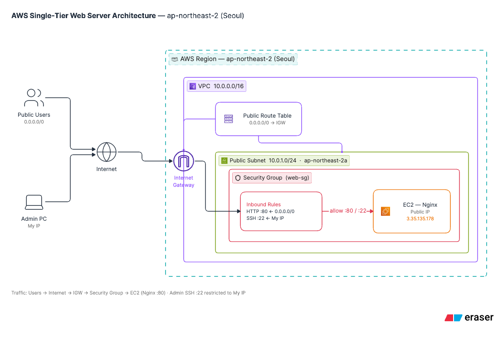
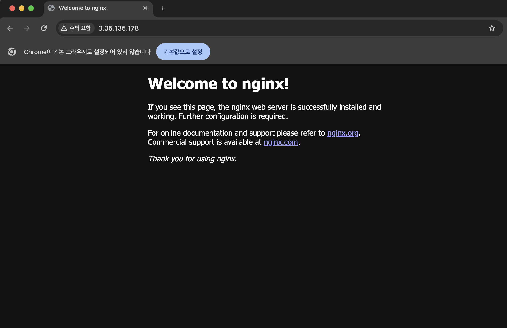

# AWS 단일 계층 웹 서비스 인프라 구축 실습

본 프로젝트는 AWS 서울 리전(`ap-northeast-2`) 환경에서 VPC, Public Subnet, Internet Gateway, Security Group을 구성하고, EC2 인스턴스에 Nginx 웹 서버를 배포하여 외부 접속을 검증한 실습 결과물입니다.

---

## 1. 아키텍처 개요

- **Region**: Asia Pacific (Seoul) (`ap-northeast-2`)
- **VPC**: `10.0.0.0/16`
- **Public Subnet**: `10.0.1.0/24` (가용 영역: `ap-northeast-2a`)
- **Internet Gateway**: VPC 연결 및 라우팅 테이블 `0.0.0.0/0 -> IGW` 연결
- **Compute**: EC2 `t3.micro` (Ubuntu 22.04 LTS)
- **Security Group**: 
  - HTTP (`80`): `0.0.0.0/0` 허용
  - SSH (`22`): 관리자 개인 IP 허용

### 아키텍처 다이어그램
상세 다이어그램 파일은 `docs/architecture.png`에서 확인할 수 있습니다.



---

## 2. 실습 진행 과정

### 1단계: 사전 준비 및 IAM 구성
- 루트 계정 대신 최소 권한(`AmazonEC2FullAccess`, `AmazonVPCFullAccess`)이 부여된 IAM 사용자를 생성하여 콘솔에 접근했습니다.
- 작업 리전을 **서울(`ap-northeast-2`)**로 고정했습니다.

### 2단계: 네트워크 및 보안 그룹 구축
- **VPC 및 Subnet**: CIDR `10.0.0.0/16`의 VPC와 `10.0.1.0/24`의 Public Subnet을 생성하고, 퍼블릭 IPv4 자동 할당을 활성화했습니다.
- **Internet Gateway & Route Table**: IGW를 VPC에 연결하고, 라우팅 테이블에 `0.0.0.0/0 -> IGW` 경로를 설정하여 서브넷과 연결했습니다.
- **Security Group**: 웹 트래픽(HTTP 80) 및 원격 접속(SSH 22)을 제어하는 보안 그룹을 생성했습니다.

### 3단계: EC2 프로비저닝 및 Nginx 배포
- 생성한 Public Subnet 및 보안 그룹 내에 `t3.micro` 인스턴스를 시작했습니다.
- SSH로 인스턴스에 접속한 뒤 Nginx 웹 서버를 설치하고 실행했습니다.

```bash
# SSH 접속
chmod 400 task-key.pem
ssh -i task-key.pem ubuntu@3.35.135.178

# Nginx 설치 및 실행
sudo apt update && sudo apt install -y nginx
sudo systemctl start nginx
sudo systemctl enable nginx

# 헬스체크 엔드포인트 생성 (방식 B)
echo "OK" | sudo tee /var/www/html/health
```

---

## 3. 웹 서비스 외부 접속 검증

과제 요구사항에 따라 외부 통신을 검증하였습니다.

- **검증 방식**: **(B) GET `http://<퍼블릭IP>/health` 호출**
- **접속 대상 IP**: `3.35.135.178`
- **검증 URL**: `[http://3.35.135.178/health](http://3.35.135.178/health)`
- **응답 결과**: `HTTP/1.1 200 OK` 및 본문 `OK` 반환 확인

### 외부 접속 검증 스크린샷

---

## 4. 트러블슈팅 요약

- **현상**: 인스턴스 내 `curl http://localhost` 호출은 성공하나 외부 브라우저 및 `curl` 호출 시 무한 로딩(Connection Timeout) 발생
- **원인**: 보안 그룹 생성 시 SSH(22) 포트만 열고 HTTP(80) 인바운드 허용 규칙을 누락
- **조치**: 보안 그룹 인바운드 규칙에 `HTTP (포트 80) / 소스 0.0.0.0/0` 추가 후 즉시 정상 응답 확인
- **상세 보고서**: `docs/troubleshooting.md`

---

## 5. 산출물 및 리소스 정리 안내

| 산출물 | 파일 경로 | 설명 |
| :--- | :--- | :--- |
| **아키텍처 다이어그램** | `docs/architecture.png` | VPC/Subnet/IGW/EC2/SG 및 트래픽 흐름도 |
| **트러블슈팅 보고서** | `docs/troubleshooting.md` | 증상-가설-검증-조치-결과-재발방지 상세 기록 |
| **리소스 정리 체크리스트** | `docs/cleanup-checklist.md` | 과금 방지를 위한 리소스 삭제 완료 내역 |

*실습 완료 후 불필요한 과금을 방지하기 위해 EC2 인스턴스 종료, 보안 그룹, IGW 및 VPC 삭제를 완료했습니다.*