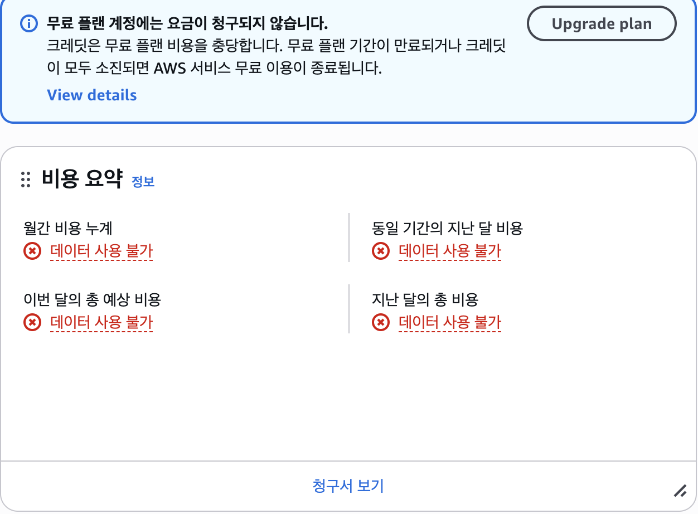

# AWS 리소스 정리 체크리스트 (Cleanup Checklist)

실습 완료 및 증빙 자료 확보 후 불필요한 과금 발생을 방지하기 위해 생성된 모든 AWS 리소스를 정리하고 점검한 내역입니다.

---

## 1. 리소스 정리 상태 점검표

| 리소스 구분 | 리소스 이름 | 적용 태그 (Key-Value) | 조치 내용 | 최종 상태 | 비고 |
| :--- | :--- | :--- | :--- | :---: | :--- |
| **EC2 인스턴스** | `task-web-server` | `Name=task-web-server` `Project=SingleTier-Task` `Environment=Dev` `Owner=LeeJusung` | 인스턴스 종료(Terminate) | **종료됨 (Terminated)** | 과금 중단 완료 |
| **탄력적 IP (EIP)** | - | - | 사용하지 않음 (퍼블릭 IP 자동할당 사용) | **해당 없음** | 잔여 EIP 없음 |
| **보안 그룹** | `web-sg` | `Name=web-sg` `Project=SingleTier-cloud-Task` `Environment=Dev` `Owner=LeeJusung` | 보안 그룹 삭제 | **삭제됨 (Deleted)** | 기본 보안 그룹만 유지 |
| **서브넷** | `task-public-subnet-2a` | `Name=task-public-subnet-2a` `Project=SingleTier-cloud-Task` `Environment=Dev` `Owner=LeeJusung` | 서브넷 삭제 | **삭제됨 (Deleted)** | - |
| **라우팅 테이블** | `task-public-rt` | `Name=task-public-rt` `Project=SingleTier-cloud-Task` `Environment=Dev` `Owner=LeeJusung` | 라우팅 테이블 삭제 | **삭제됨 (Deleted)** | 기본 라우팅 테이블 외 삭제 |
| **인터넷 게이트웨이** | `task-igw` | `Name=task-igw` `Project=SingleTier-cloud-Task` `Environment=Dev` `Owner=LeeJusung` | VPC 분리(Detach) 후 삭제 | **삭제됨 (Deleted)** | - |
| **VPC** | `task-vpc` | `Name=task-vpc` `Project=SingleTier-cloud-Task` `Environment=Dev` `Owner=LeeJusung` | VPC 삭제 | **삭제됨 (Deleted)** | 기본 VPC만 유지 |
| **IAM 사용자** | `cloud-task-user` | `Environment=Dev` `Owner=LeeJusung` | 과금 발생 없음 확인 | **유지 / 비활성화** | 과금 비대상 리소스 |

---

## 2. 표준 태깅 정책 (Resource Tagging Policy)

실습 인프라의 리소스 식별, 소유권 명확화 및 비용 추적을 위해 모든 리소스에 다음 표준 태그 규칙을 일관되게 적용합니다.

| 태그 키 (Key) | 태그 값 (Value) 예시 | 설명 | 필수 여부 |
| :--- | :--- | :--- | :---: |
| `Name` | `task-web-server`, `task-vpc` | 리소스별 고유 식별 명칭 | 필수 |
| `Project` | `SingleTier-Task` | 리소스가 속한 과제/프로젝트명 | 필수 |
| `Environment` | `Dev` | 리소스 환경 구분 (`Dev` / `Stage` / `Prod`) | 필수 |
| `Owner` | `cloud-task-user` | 리소스 생성 및 관리 책임자 식별 | 필수 |

---

## 3. 과금 방지 최종 확인

- [x] 서울 리전(`ap-northeast-2`) 내 실행 중인(Running) EC2 인스턴스 0대 확인
- [x] 미사용 상태로 남아있는 독립 EBS(Elastic Block Store) 볼륨 0개 확인
- [x] 할당된 미사용 탄력적 IP(Elastic IP) 0개 확인
- [x] AWS Cost Management / Billing 콘솔에서 실시간 잔여 유료 리소스 없음 확인

