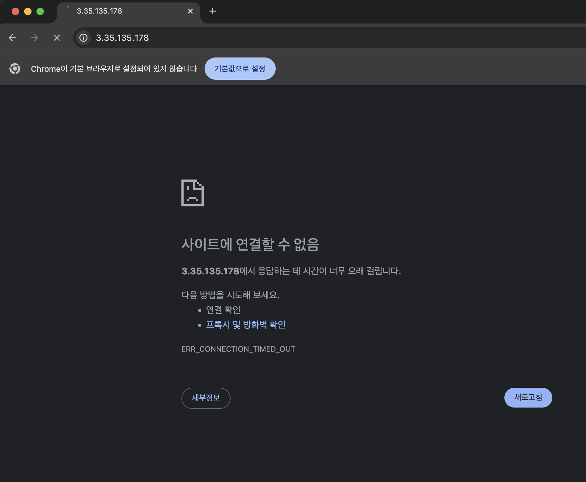

# 트러블슈팅 보고서 (Troubleshooting Report)

## 개요
- **일시**: 2026-08-21
- **환경**: AWS ap-northeast-2 (Seoul), Ubuntu 22.04 LTS, Nginx 1.28.3
- **대상 인스턴스 IP**: `3.35.135.178`
- **이슈 요약**: EC2 내부에서는 Nginx 웹 서버가 정상 동작하나, 외부 클라이언트에서 HTTP(80) 포트 접속 시 연결 타임아웃(Connection Timed Out) 발생

---

## 1. 증상 (Symptom)
- EC2 인스턴스에 SSH로 접속하여 로컬 호출 시 정상 응답을 반환함.
  ```bash
  $ curl -I http://localhost
  HTTP/1.1 200 OK
  Server: nginx/1.28.3 (Ubuntu)
  ```
- 로컬 PC(외부 인터넷 환경)에서 브라우저 및 `curl`로 퍼블릭 IP 호출 시 무한 로딩 후 요청이 실패함.
  ```bash
  $ curl -i [http://3.35.135.178/health](http://3.35.135.178/health)
  curl: (28) Failed to connect to 3.35.135.178 port 80: Operation timed out
  ```
  
---

## 2. 가설 수립 (Hypothesis)
1. **가설 1**: Public Subnet의 라우팅 테이블에 Internet Gateway(IGW) 경로(`0.0.0.0/0 -> IGW`)가 누락되었을 가능성.
2. **가설 2**: EC2 인스턴스에 적용된 보안 그룹(Security Group) 인바운드 규칙에서 HTTP(80) 포트 트래픽이 허용되지 않았을 가능성.
3. **가설 3**: Nginx 서비스가 `80` 포트에서 외부 인터페이스(`0.0.0.0:80`)를 바인딩하지 않고 `127.0.0.1:80`으로만 수신 대기하고 있을 가능성.

---

## 3. 검증 (Verification)
- **가설 3 검증**: EC2 내부에서 포트 바인딩 상태 확인
  ```bash
  $ sudo ss -tulpn | grep :80
  tcp   LISTEN 0      511          0.0.0.0:80        0.0.0.0:*    users:(("nginx",pid=...,fd=...))
  ```
  → Nginx는 `0.0.0.0:80` 전체 인터페이스에서 정상 수신 중이므로 서버 내부 문제는 아님.
- **가설 1 검증**: AWS VPC 콘솔에서 Public Route Table 확인
  → `0.0.0.0/0 -> igw-xxxx` 경로가 서브넷과 정상 연결되어 있음 확인.
- **가설 2 검증**: EC2에 연결된 보안 그룹(`web-sg`) 인바운드 규칙 점검
  - `SSH (Port 22)`: 관리자 공인 IP 허용 확인
  - `HTTP (Port 80)`: **인바운드 규칙 누락 확인** (원인 도출)

---

## 4. 조치 (Action)
AWS Management Console에서 보안 그룹 인바운드 규칙에 HTTP(80) 포트를 추가함.

- **대상 보안 그룹**: `web-sg`
- **추가 규칙**:
  - **유형**: `HTTP`
  - **프로토콜**: `TCP`
  - **포트 범위**: `80`
  - **소스**: `Anywhere-IPv4` (`0.0.0.0/0`)
  - **설명**: `Allow HTTP inbound traffic from anywhere`

---

## 5. 결과 (Result)
- 로컬 PC에서 외부 헬스체크 엔드포인트 호출 시 정상 응답 반환 확인.
  ```bash
  $ curl -i [http://3.35.135.178/health](http://3.35.135.178/health)
  HTTP/1.1 200 OK
  Server: nginx/1.28.3 (Ubuntu)
  Content-Type: text/html
  Content-Length: 3

  OK
  ```
- 브라우저에서도 `http://3.35.135.178` 접근 시 정상 렌더링 확인 완료.

---

## 6. 재발 방지 대책 (Prevention)
1. **인프라 배포 체크리스트 운영**: 인스턴스 생성 전 네트워크(VPC/Subnet/IGW)뿐만 아니라 애플리케이션 서비스 포트(HTTP 80, HTTPS 443 등)에 대한 보안 그룹 템플릿을 사전 점검.
2. **IaC(Infrastructure as Code) 도입 권장**: 추후 Terraform 또는 CloudFormation과 같은 코드로 인프라를 정의하여 수동 콘솔 작업 시 발생할 수 있는 규칙 누락 휴먼 에러 방지.