# 1. 기본 보안 및 네트워크 설정
## 1. SSH 접속포트 20022로 변경, Root 원격 로그인 차단 설정 및 확인
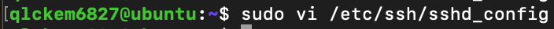
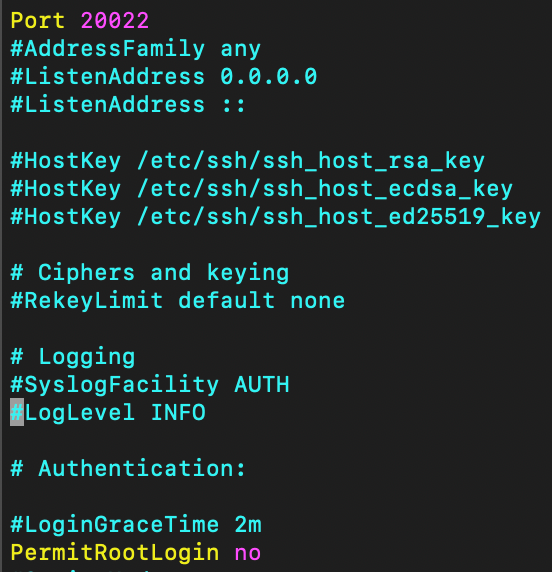
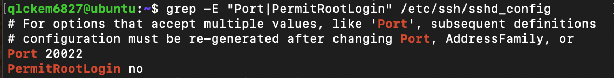
## 2. 소켓 파일 수정 및 포트 변경이 적용됨을 확인
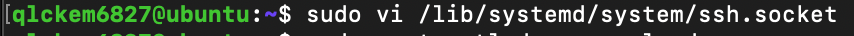
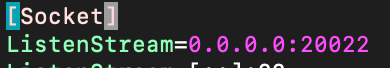
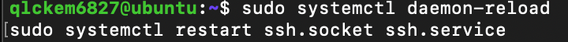
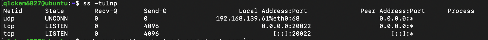
## 3. 기본 정책 설정 (모든 인바운드 차단, 아웃바운드 허용)
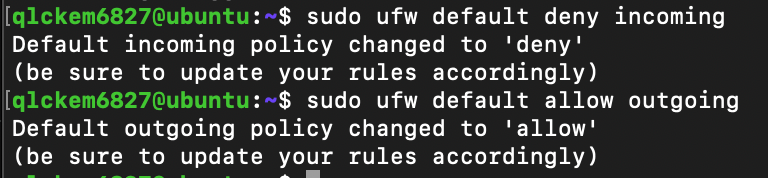
## 4. 인바운드 허용 포트는 TCP 20022(SSH), TCP 15034(APP)만 허용
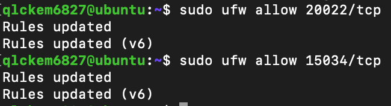
## 5. UFW 방화벽 설정이 적용됨을 확인
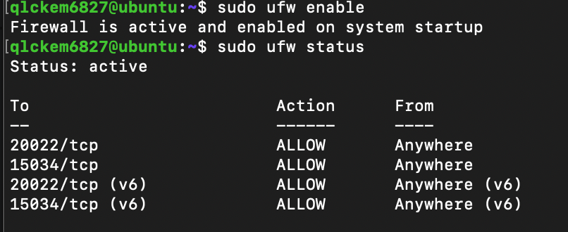

# 2. 계정/그룹/권한 체계(협업 + 최소 권한)
## 1. 그룹 생성
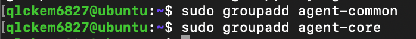
## 2. 계정 생성 및 그룹에 추가
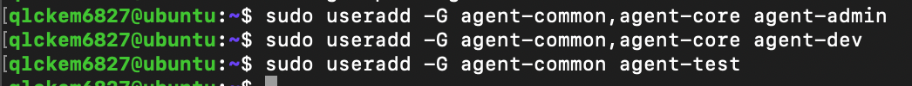
## 3. 디렉토리 생성
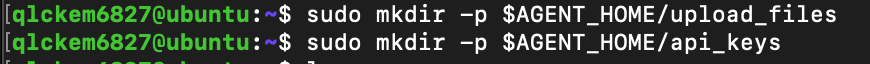
## 4. 소유권 설정
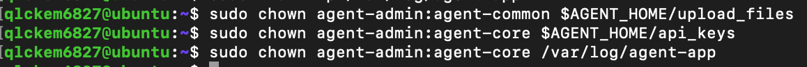
## 5. 권한 및 SetGID 설정
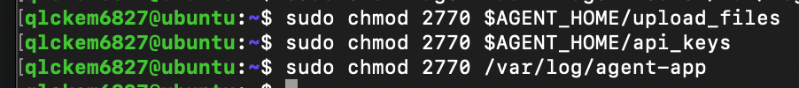
## 6. 계정 그룹 확인

## 7. ls -l 로 소유/권한 확인
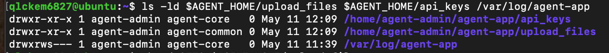
## 8. getfacl로 소유/권한 확인
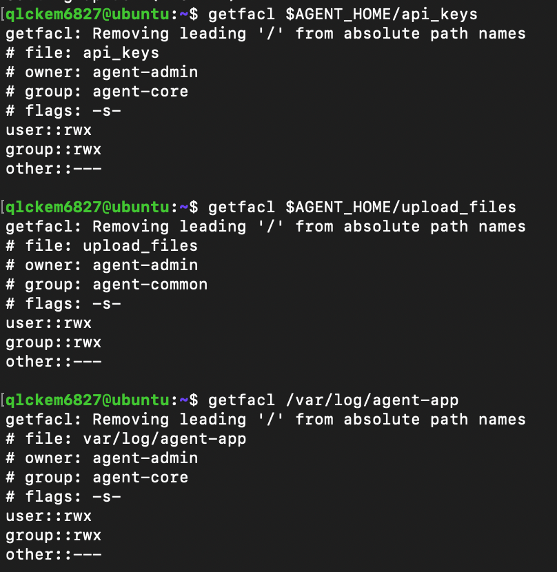
# 3. 애플리케이션 실행 환경 구성(제공 Python 앱)
## 1. 일반 계정으로 이동
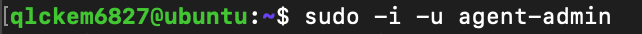
## 2. 키 파일 생성

## 3. 환경 변수 설정
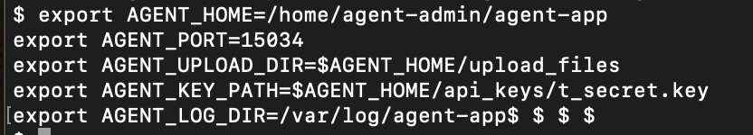
## 4. 앱 실행 및 종료
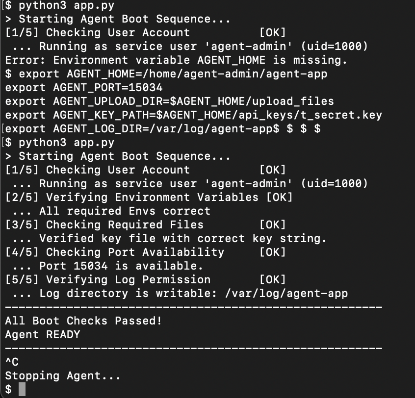
# 4. 시스템 관제 자동화 스크립트 (monitor.sh) 구현
## 1. monitor.sh 구현 및 log 폴더 생성
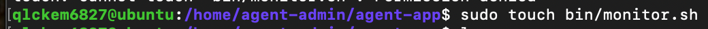
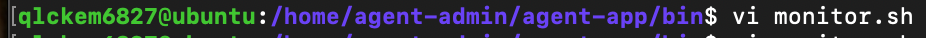
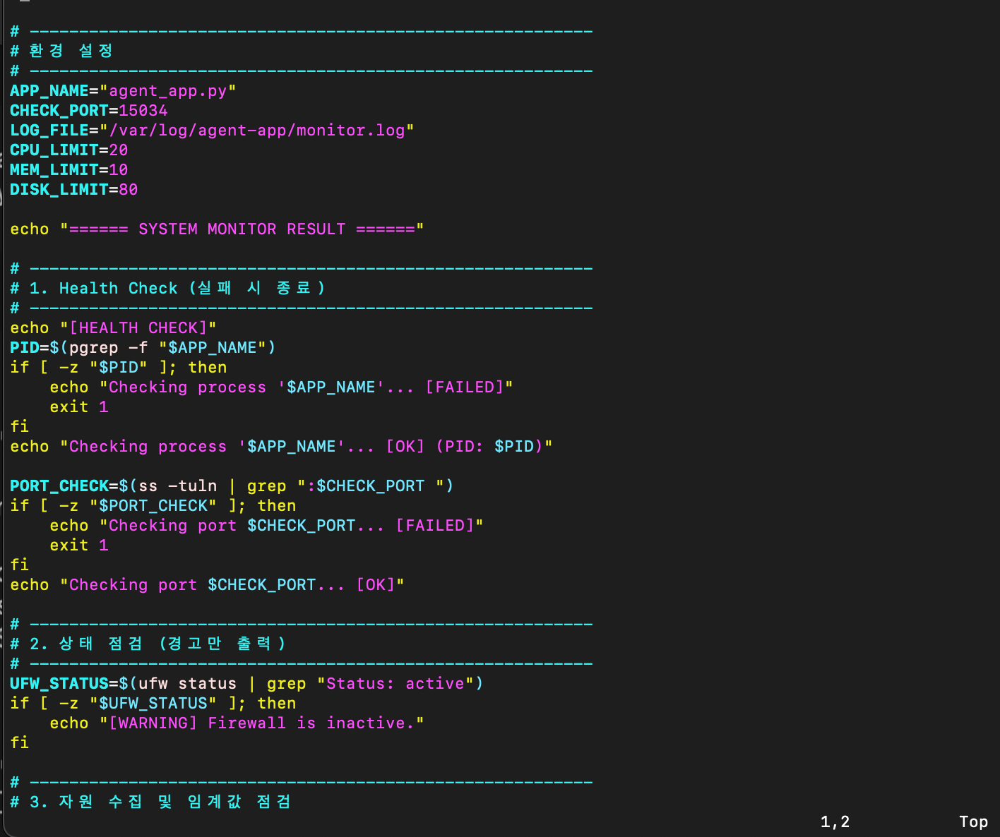
## 2. monitor.sh 실행이 되는지 확인
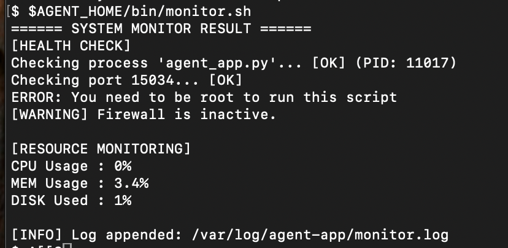
## 3. 권한 및 파일 정책 설정
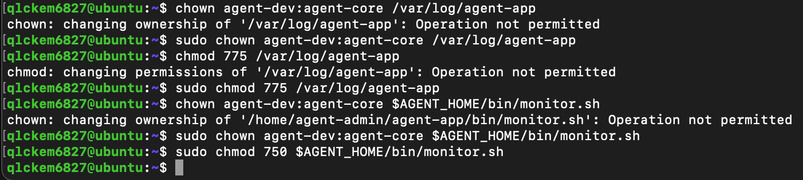
## 4. cron 설정
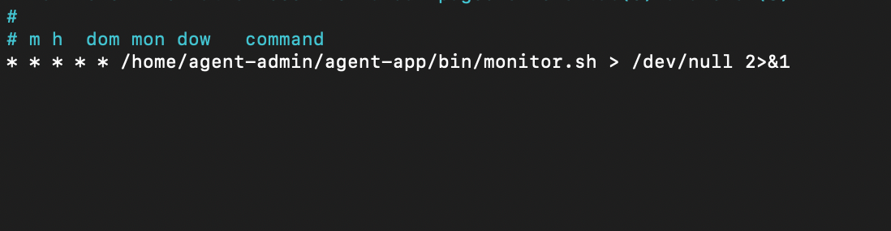
## 5. 1분마다 로그가 기록되는지 확인
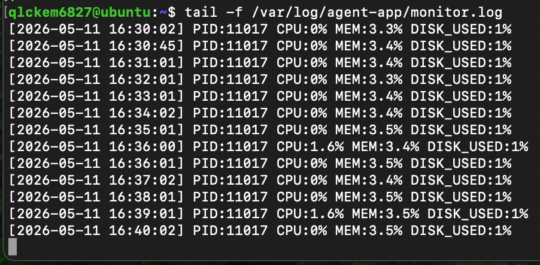